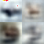

# Reimplementation of VAE
The purpose of this repositiory is to reimplement VAE to build familiarity with latent models and their loss functions. A side goal of this repositiory was to learn about hydra configs.


Original images encoded to get the next image




Result of the image generation process under VAEs after encoding (with $q_\phi(z | x)$) then decoding (with $p_\theta(x|z)$) the latent 


Images sampled from the prior of the latent


The above images were obtained with a beta value of 1 on the kl term, a latent dimension of 256, a cnn decoder, a cnn encoder, lr=0.0005, with AdamW and Exponential decay for 10 epochs with batch size of 100.

For details on the cnns see the vae_reimplement/models.py file

## working with this repo
after creating a conda environment of python >= 3.9, proceed with the following commands
```bash
pip install -e . # this installs the required packages and makes the vae_reimplement package available to python's path.
python run.py # this will run the hydra configured default. See https://hydra.cc/docs/1.3/intro/ for details.
```


this project was logged with wandb see https://wandb.ai/jakobbbjorner/vae_reimplement/workspace?nw=nwuserjakobbbjorner
